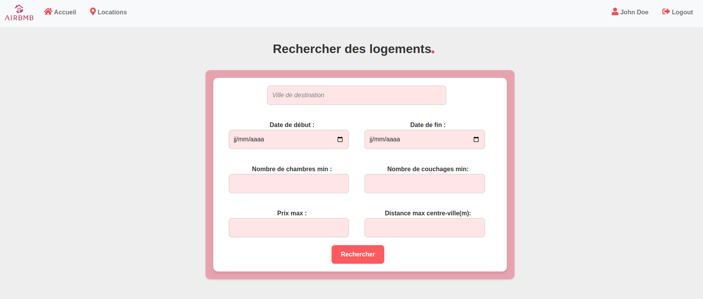
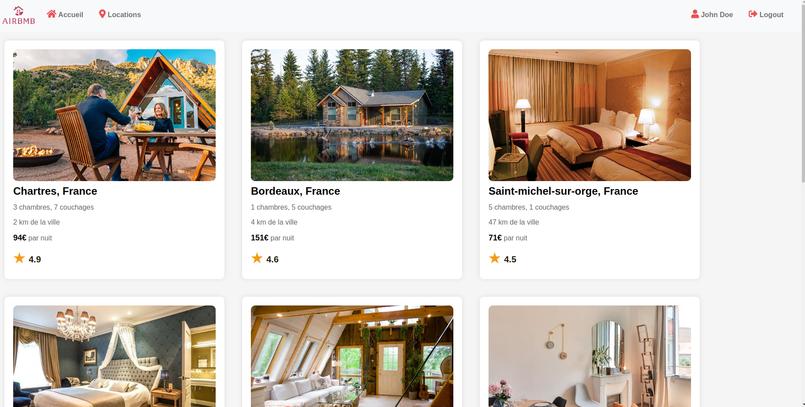
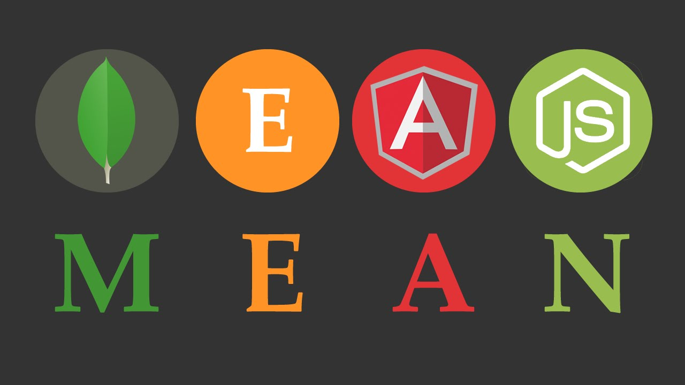
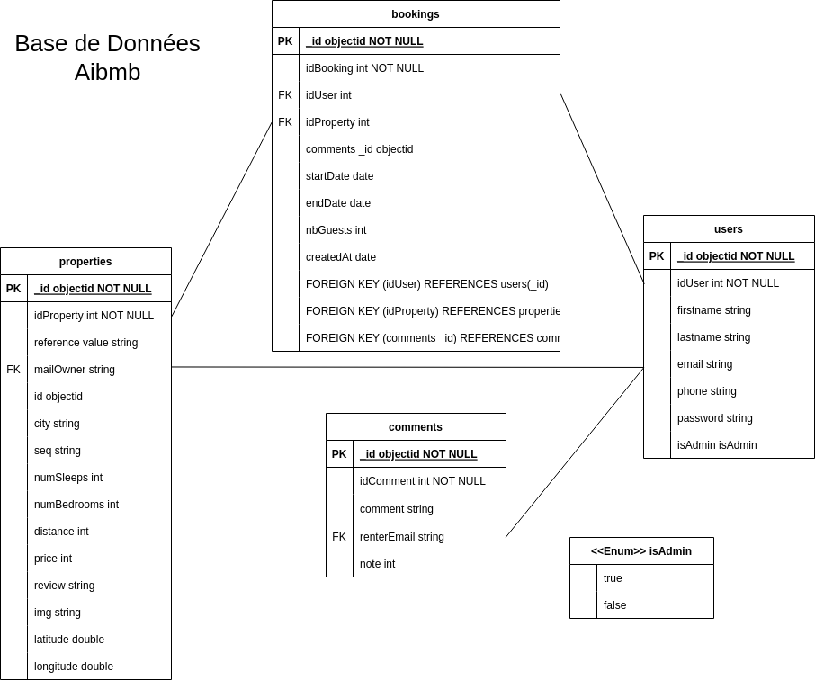

<div style="text-align:center;">
    
    <h2> AirBmB - Application web de location de logements</h2>
    <h3>Réalisée dans le cadre de l'UE <i>"HAI806I Architecture Web Avancée"</i></h3>
    <a href="Others/projet_MEAN_HAI806I_2023_2024.pdf">Lien du Sujet</a>
    <br/><br/>
    <h3>Images du site :</h3>
    
    
    <br/><br/>
</div>


<!-- Site déployé sur le lien suivant :  -->

# Auteurs :
- [*Éric Gilles*](https://github.com/eric-gilles/)
- [*Morgan Navel*](https://github.com/MorganNavel/)


## Présentation du projet :
L’application web est sous une architecture MEAN (MongoDB, Express, Angular et Node.js) ainsi que Bootstrap pour le design.
<h3>1/ Architecture MEAN : MongoDB, Express, Angular, Node.js</h3>
<div style="text-align:left;">
  <br/><br/>
</div>

- **MongoDB** : base de données
- **Express** : framework pour Node.js
- **Angular** : framework pour le front-end
- **Node.js** : environnement d'exécution JavaScript côté serveur

[](#)
[](#)
[](#)
[](#)
[](#)
<br/>

### 2/ Structure des échanges entre les différentes couches :


### 3/ Librairies utilisées :
- **Mongoose** : pour la gestion de la base de données MongoDB
- **Cors** : pour permettre les requêtes HTTP cross-origin
- **Dotenv** : pour la gestion des variables d'environnement
- **Joi** : pour la validation des données
- **Express JWT** : pour la gestion des tokens JWT
- **Nodemon** : pour le redémarrage automatique du serveur Node.js
- **Mapbox** : pour la géolocalisation des biens

## Schéma UML de la Base de données MongoDB :




## Liste des Fonctionnalités :

- **Recherche multicritères** :
  - Date de début de location
  - Date de fin de location
  - Commune
  - Prix max
  - Nombre de chambres min
  - Nombre de couchages min
  - Distance max au centre ville (exprimée en mètres)
- **Visualisation des biens à louer** :
  - Caractéristiques des biens (ville, prix/nuit, nombre de chambres, nombre de couchages, distance au centre ville)
  - Avis associé (moyenne des notes données par les loueurs)

- **Sélection d'un bien** :
  - Création d'un document dans la table Location
  - Facturation fictive

- **Géolocalisation sur une carte**

- **Voir Avis d'un bien**
- **Laisser un avis (notes et commentaires)**

- **Authentification des utilisateurs (Enregistrement / Connexion)**


- **Affichage du profil utilisateur**

## Installation du projet en local:
1. Cloner le projet :
```bash
git clone https://github.com/MorganNavel/projet-mean.git
```

2. Installer les dépendances du serveur :
```bash
cd API/
npm i
```

3. Installer les dépendances du client :
```bash
cd Client/mean/
npm i
```

4. Lancez le serveur MongoDB :
```bash
sudo service mongod start
```

5. Lancer le serveur Node.js :
```bash
cd API/src/
npm run dev
```

5. Lancer le client Angular dans un autre terminal :
```bash
cd Client/mean/
npm run start
```

6. Ouvrir un navigateur et accéder à l'adresse suivante :  [http://localhost:4200](http://localhost:4200)